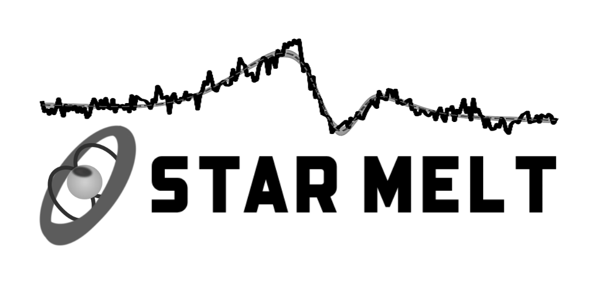

# STAR MELT

STAR-MELT is a Python package and Jupyter notebook toolkit for emission line analysis of young stellar objects (YSOs) and other stars. It provides tools for reading, visualising, and fitting stellar spectra, including automated and interactive routines for emission line identification, continuum/photosphere subtraction, and multi-component Gaussian fitting.

[See the one-minute STAR-MELT overview video here.](https://youtu.be/grDMizYmU6U)\
[See the STAR-MELT paper (Campbell-White+,MNRAS,2021) here.](https://ui.adsabs.harvard.edu/abs/2021arXiv210802552C/abstract)

------------
## Download & install
To use the STAR-MELT package and Jupyter notebook, install directly from GitHub:
```
pip install git+https://github.com/justyncw/STAR_MELT.git
```

Or download or clone the repository into a local directory 
```
cd STAR_MELT-main
pip install .
```
Then start Jupyter notebook / lab from that directory:
```
jupyter notebook 
```
```
jupyter lab
```

Then open the STAR_MELT_example_notebook.ipynb or one of the other notebooks from the notebooks directory.

The example notebook contains a tutorial for the package functions using the example data.

Further example scripts are included, which feature routines for automatically carrying out simple measurements and analysis on multiple spectra. 

------------
## Online Notebooks

To launch and try the STAR MELT tutorial notebook on Binder, click the badge below.

[](https://mybinder.org/v2/gh/justyncw/STAR_MELT/HEAD?urlpath=%2Fnotebooks%2FSTAR_MELT_example_notebook.ipynb)

Or open the example notebook directly in Google Colab:

[](https://colab.research.google.com/github/justyncw/STAR_MELT/blob/main/notebooks/STAR_MELT_example_notebook.ipynb)

This will open the notebook in an online Jupyter or Colab instance.\
Once in the notebook, click on a code cell and hit shift+enter to run it and advance to the next cell. Selections can be made with the ipywidgets and qgrids. 

------------
## Simple example notebook

[Simple STAR-MELT example notebook](https://github.com/justyncw/STAR_MELT/blob/main/notebooks/SM_fit_gauss.ipynb)

This notebook shows you how to read in spectra from the compatabile .FITS files, plot the spectra, select an emission line to plot, and fit the emission line with (multiple) Gaussian components


------------
## Release Notes

#### Contributors:
* Justyn Campbell-White (ESO, University of Dundee)
* Aurora Sicilia-Aguilar (University of Dundee)
* Carlo F. Manara (ESO)
* Antonio Frasca (INAF Catania)
* Kyara Soto Villarreal (Smith College)

This is the development version of the STAR-MELT package. Please cite [(“The STAR-MELT PYTHON package for emission-line analysis of YSOs” Campbell-White, Sicilia-Aguilar, Manara et al. MNRAS, 507, 3331, 2021)](https://ui.adsabs.harvard.edu/abs/2021arXiv210802552C/abstract) if you use STAR-MELT for your analysis. 

<sub>
Originally funded by STFC grant: ST/S000399/1
</sub>

#### Example data and standard star FITS files are from the [ESO Science Archive](http://archive.eso.org/).

* EX Lupi: ESO Programme IDs 099.A-9010, 082.C-0390, 085.C-0764
* GQ Lupi: ESO Programme IDs 075.C-0710, 085.A-9027
* CVSO109: ESO Programme IDs 106.20Z8.009, 106.20Z8.002, [ODYSSEUS & PENELLOPE Zenodo](https://zenodo.org/communities/odysseus/)     


#### Emission line parameters are from the [NIST database](https://physics.nist.gov/PhysRefData/ASD/lines_form.html).  
* Kramida, A., Ralchenko, Yu., Reader, J. and NIST ASD Team (2020). NIST Atomic Spectra Database (version 5.8), [Online]. Available: <https://physics.nist.gov/asd> [Tue Jun 22 2021]. 


------------
## Instrument Compatibility
STAR-MELT will read the spectral data directly from the FITS files for the following instruments:
* ESO FEROS
* ESO HARPS
* ESO XSHOOTER
* ESO UVES
* ESO ESPRESSO
* CFHT ESPaDOnS
* HST COS
* HST STIS
* XMM-Newton RGS
* CAFOS
* MIKE


Reference emission lines and radial velocity standard stars are provided for the ground based data.

If your FITS files have a similar structure to these, they may also work. 
Further full instrument compatibility is ongoing. 

Alternatively, spectral data from any source can be provided as a txt/csv file of wave vs flux.

Full package compatibility with HST and XMM spectra is still under development. 


------------
#### QGRID install and enable
The STAR-MELT notebook uses the [QGRID next package](https://github.com/zhihanyue/qgridnext) for filtering dataframes


Installing with pip::
```
pip install qgridnext
jupyter nbextension enable --py --sys-prefix qgridnext

# only required if you have not enabled the ipywidgets nbextension yet
jupyter nbextension enable --py --sys-prefix widgetsnbextension
```

Installing with conda::
```
# only required if you have not added conda-forge to your channels yet
conda config --add channels conda-forge

conda install qgridnext
```

If using with Jupyter lab and you have any issues with the build, try:

```
#mirror maintained for lab
jupyter labextension install @j123npm/qgrid2@1.1.4

```

Usage:

```python
#control/cmd/shift click to make selections
new_dataframe=qgrid_widget1.get_selected_df()
```
```python
#use qgrid column filters
new_dataframe=qgrid_widget1.get_changed_df()
```
